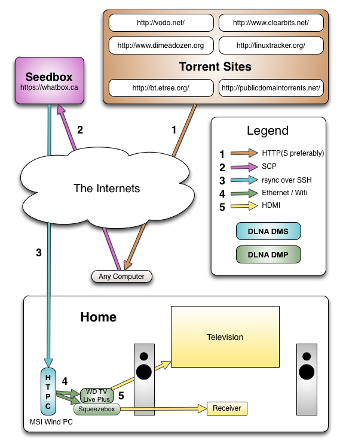

htpc
====

Because cable is totally and completely ridiculous.

The array of options available to setup a home entertainment system driven by media residing on a computer is increasingly large. This is how I've been doing it, since about 2009. 

# Header 1 #

# Header 2 #

